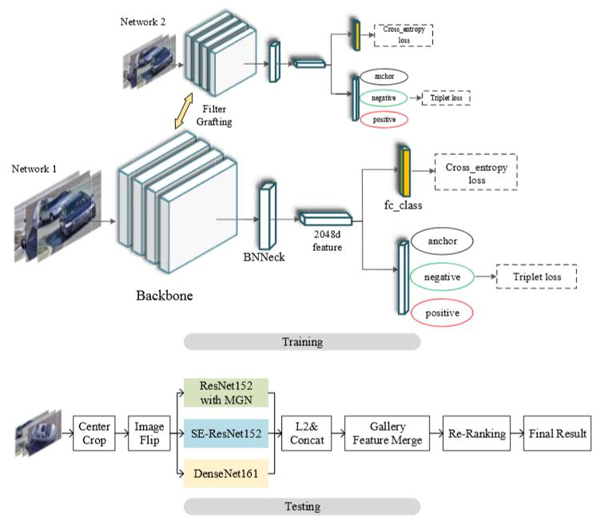
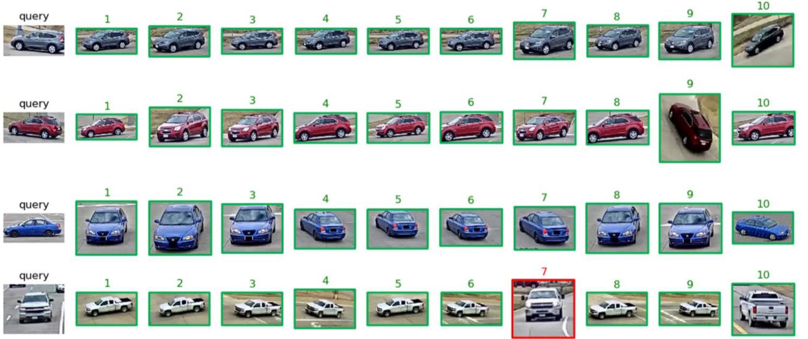

# Implementation of Vehicle Re-Identification Based on Complementary Features for 2020 AICity Challenge Track2 
This repository contains the source codes of vehicle Re-ID of our implementation for 2020 AICity Challenge, and we got 5-th place in the vehicle Re-ID track of AIC2020.
######
## Dependencies
python 2.7 / python 3.6 

pytorch 1.0 +

torchvision 0.2.1 +

refer to our source codes for other dependencies  

## Datasets
Datasets used in our implementation are avialable at 

| Datasets        | Description | Download link                                                    |
| -------------------------- | ---------------------------------------------- | ------------------------------------------------------------ |
| Original train set       | CityFlow train set and Simulation Set by VehicleX       | [link](https://drive.google.com/file/d/1by-7hUFTzFuAyRGASlSRZwSkEwAiPhls/view?usp=sharing) |
| Crop train set for cityflow  | CityFlow train set cropped by 2019 1st Baidu's detector  |   [link](https://drive.google.com/file/d/1S_R4OgnFMB1JrSIN21ZKHsMQE1nS45NH/view?usp=sharing)  |
| All images with fake label test test | CityFlow train set & test set(fake label) and Simulation Set by VehicleX            | [link](https://drive.google.com/file/d/1Z2Zpnp0qmO2PVSmsLQigb14jUSC-Lnzg/view?usp=sharing) |


## Code Structure ##

**Each part has its own README file.**

* global_model contains source codes of training vehicle reid models including se_resnext101, se_resnet152, resnet152, hrnet_48w, se_resnet152_ibnb, densenet161, dpn107, senet154 etc.

* mgn_mode contains source codes of training vehicle reid models including resnet152 with MGN, resnet152 with SAC.

* post_processing contains several post-processing methods for Re-ID task.

## Running Code orderly ##
1. Train each single model in global_model and mgn_model.

2. Extract features for test set using each single model in global_model and mgn_model.

3. Move all pkls of features to the same directory and utilize several post-processing methods to improve single model performence.


-----
**Notes:**
You can directly use our trained model and extracted features for implementation, the link is as follows:

| Models  | Usage   | Description | Download link                                                    |
| -------------------------- | ---------------------------------------------- | ------------------------------------------------------------ |
| ImageNet pretrained models  | Train     | for ```global_model/pretrain_models```       | [link](https://drive.google.com/file/d/1pcZRbtJ8iaI99nzL9W1ZxQC0yu2lEPrF/view?usp=sharing) |
| ImageNet pretrained models  | Train     | for ```mgn_model/weights```  |   [link](https://drive.google.com/file/d/1kuUS8fltZCFYOHbQtzJyG9lBXOl6cijV/view?usp=sharing)  |
| Trained model by us | Test   | contain four models checkpoint mentioned in our paper   | [link](https://drive.google.com/file/d/1VWXZmHAyM5zvfLujy7s0WNKhi50Bryc6/view?usp=sharing) |

| Features  | Usage    | Description | Download link                                                    |
| -------------------------- | ---------------------------------------------- | ------------------------------------------------------------ |
| Pkls for features |Test | features extracted by each model  and performed by several post-processing      | [link](https://drive.google.com/file/d/1Hag_OBDAnT-gZfklCHZG66U9gbBBuubQ/view?usp=sharing) |

## Basic framework ##

* The basic framework of our approach .  


* Results generated by our method.

